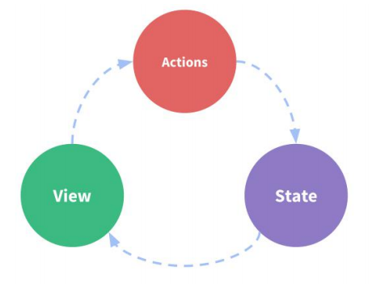

# vue学习

> A Vue.js project

## 创建

``` bash
# 安装依赖
npm install

# 测试环境运行
npm run dev

# 打包
npm run build

# 打包并查看报告
npm run build --report
```

For a detailed explanation on how things work, check out the [guide](http://vuejs-templates.github.io/webpack/) and [docs for vue-loader](http://vuejs.github.io/vue-loader).

# 一、Vue基础
详见[`VueTest`](https://github.com/jance-hui/learnVue/tree/master/VueTest)

### 1. 模板语法：
    v-bind: / : 强制数据绑定
    v-on: / @ 强制事件监听
    {{...}} 向页面输出数据，可调用对象方法
                
### 2. 计算属性 ：
`computed`

    初始化 和 相关属性发生时执行
    通过get、set实现对属性数据的显示和监视
    
    注：计算属性存在缓存，多次读取只执行一次
                
### 3. 监视 
`watch配置 / $watch()方法`
    监视指定属性，属性变化时，函数直接调用
                
### 4. class 与 style 绑定：
    class绑定： :class="xxx" // xxx可为字符串、对象、数组
    style绑定： :style="{...}" // {...}为json对象
    
### 5. 条件渲染：v-if / v-else 和 v-show
    为true时显示，否则隐藏
    
    区别：v-if / v-else 结果为false时，在HTML中移除(内存中对象不存在)
          v-show 通过样式显示/隐藏 style="display=none"，内存中存在
    
    注：当需反复变换时，使用v-show，避免内存中反复创建、删除对象
    
### 6. 列表渲染： v-for
        对数组：v-for="(user, index) in users(数组)" :key="index"
        对对象：v-for="(user, key) in users[0](数组第一个对象)" :key="key"
    
### 7. 列表搜索、过滤、排序
`filter()`：对数组过滤

`sort()`：对数组排序
                
### 8. 事件处理
    绑定监听：v-on:xxx="fun" / @xxx="fun" / $xxx="fun(参数)"
        默认事件形参为event，隐含属性对象为$event
    
`事件修饰符`

        .prevent / event.preventDefault() 阻止事件的默认行为
        .stop / event.stopPropagation 阻止事件冒泡
        
`按键修饰符`

        .keycode 操作某个keycode值的键
        .keyName 操作某个按键名的建（少部分）
    
`注：`

        event.target.innerHTML：输出HTML值
        event.target.value：输出内容
    
### 9. 表单数据绑定
        使用v-model (双向绑定) 自动收集表单数据
    
### 10. Vue实例生命周期
    a.初始化状态
        beforeCreated() 刚在内存中创建，还未初始化data、methods
        cerated()       已在内存中创建，且已初始化data、methods，未编译
        beforeMount()   已编译，未挂载带页面
        mounted()       已挂载到页面指定容器中显示
        
    b.更新状态
        beforeUpdate()  状态更新之前，data已更新，页面未更新
        updated()       都已更新
        
    c.销毁状态
        beforeDestory() 实例销毁之前，实例vm仍可用
        destoryed()     已销毁
    
    ·created() / mounted() 方法常用于发送ajax请求、启动定时器等异步任务
    ·beforeDestory() 做收尾工作。如清除定时器
    
### 11. Vue动画
    操作 css 的 transtation / animation
    
    基本过渡动画：
        a.目标元素外加transtation标签：<transtation name="xxx"> ... </transtation>
        b.定义 xxx 的 css 样式
        
`transtation过程`：（常用）

        显示enter：
            xxx-enter           显示之前
            xxx-enter-active    显示过程中    
            xxx-enter-to        显示之后
        离开leave：
            xxx-leave           离开之前
            xxx-leave-active    离开过程中
            xxx-leave-to        离开之后
    
### 12. 过滤器
    对要显示的数据进行特定格式化后再显示
    
    注：为改变源数据，产生了新的对应数据
    
`定义：`
```js
// 定义过滤器
  Vue.filter('filterName', function (value, format='YYYY-MM-DD HH:mm:ss') {
    // return new Value
    return moment(value).format(format);
  })
```     
`使用：`
```html
<div>{{myData | filterName}}</div>
<div>{{myData | filterName(arg)}}</div>
```    
    
### 13. 指令
`内置指令`
 
    v:text: 更新元素的textContent
    v-html: 更新元素的innerHTML
    v-if:   若为true，当前标签显示在页面上
    v-else: 若为false，当前标签显示在页面上
    v-show: 通过css : display样式显示true/隐藏false标签
    v-for:  遍历数组、对象
    v-on:   绑定监听事件，常用 @ 代替
    v-bind: 强制绑定解析式，可缩写为 :
    v-model:双向绑定数据，常在input中使用
    ref:    指定唯一标识符，vue对象通过 $els 属性，访问该对象
    v-cloak:防止闪现，与 css 配合：[v-cloak] {display : none}
    
`自定义指令`

    注册： 全局指令
            Vue.directive('指令名', function(el, binding){
                //将字符串全改为大写
                el.innerHTML = binding.value.toupperCase()
            })
           局部指令
           directives : {
               '指令名' : {
                   bind (el, binding) {
                     //将字符串全改为小写
                     el.innerHTML = binding.value.toLowerCase()
                   }
               }
            }
    使用： 
            <p v-指令名="所传数据"></p>
    
### 14.自定义插件
    Vue插件是一个包括install方法的对象；
    
    通过install方法给Vue 或 Vue 实例添加方法，定义全局指令等。
                
# 二、Vue组件化编码
[`src-1`](https://github.com/jance-hui/learnVue/tree/master/src-1) 应用HelloWorld组件，显示应用HelloWorld组件

[`src-2`](https://github.com/jance-hui/learnVue/tree/master/src-2) 填写个人建议组件，组件间通信props

[`src-todos-props`](https://github.com/jance-hui/learnVue/tree/master/src-todos-props) 任务列表，组件间通信：props

[`src-todos-others`](https://github.com/jance-hui/learnVue/tree/master/src-todos-others) 任务列表，组件间通信：自定义事件、消息订阅与发布(PubSuB)、slot插槽
### 1. .vue文件结构

```vue
<template>
    <!--写 HTML 代码-->
</template>

<script >
    // 写 js 代码
    export default { // 向外默认暴露一个配置对象，与vue一致
    }
</script>

<style>
    /*写 css 代码*/
</style>
```    
### 2. Vue项目创建、打包、发布
`创建`

    npm install -g vue-cil      // 使用vue-cli脚手架创建项目
    npm install                 // 安装依赖
    npm run dev / npm start     // 运行开发环境
`打包`

    npm run bulid               // 生成dist打包文件夹
`发布`

    静态发布：
        npm install -g serve    // 安装serve
        npm dist                // 发布
    
    动态发布：
        a.修改配置wbepack文件夹下 prod.conf.js 文件下新增
            output:{
                publicPath : '/xxx/'    // 打包文件名
            }
        b.npm run bulid         // 重新打包
        c.修改 dist 文件夹名为项目名 xxx
        d.拷贝至 Tomcat 动态服务器的 webapps 目录下：http"//localhost:8080/xxx 访问    
    
### 3. 代码规范检查工具eslint
`提供以下支持：`

        ES 、 TSX 、 style检查 、 自定义错误与提示
    
`提供以下校验：`

        a.语法错误检验
        b.不重要或丢失标点符号，如 ;
        c.无法运行到代码块
        d.未被使用的参数提醒
        e.确保样式统一规则
        f.检查变量命名   
    
### 4. 组件化编码步骤
    a.拆分组件
    b.编写静态组件
    c.编写动态组件
    d.组件间交互
    
### 5. 本地数据存储
    localStorage(需对数据进行深度监视 deep:true )
```js
/*
* 使用localStorage储存数据的工具类
* 1.向外暴露函数（向外暴露一个功能）
* 2.向外暴露对象（向外暴露多个功能）
 */
const TODOS_KEY = 'todos_key'
export default {
  saveTodos(todos){ // 更新数据
    window.localStorage.setItem(TODOS_KEY, JSON.stringify(todos))
  },
  getTodos(){ // 读取数据
    return JSON.parse(window.localStorage.getItem(TODOS_KEY) || '[]')
  },
}
```  
    
### 6. 组件间通讯
    1.props
    2.自定义事件
    3.消息订阅与发布(PubSub库)
    4.slot插槽
    5.vuex
    

# 三、Vue发生ajax请求

[`src-ajax`](https://github.com/jance-hui/learnVue/tree/master/src-ajax) ajax通信：vue-resource、axios

### 1. vue-resource
    a.下载插件：
```
npm install --save vue-resource
```
    b.使用：main.js中引入，Vue使用：
```js
import VueResource from 'vue-resource'
//声明使用vue-resource插件
Vue.use(VueResource) // 内部会给vm对象和组件对象添加一个属性：$http（get()/post()请求方法）
```   
    c.使用：App.vue中使用：
```js
      this.$http.get(ajaxUrl).then(
        response=>{
          // 请求成功
        },
        response=>{
          // 请求失败
        }
      )
```          
    
### 2. Axios
    a.下载插件：
```
npm install --save axios
```

    c.使用：App.vue中使用：
```js
    // 引入库
    import Axios from 'axios'
    // 使用
    Axios.get(ajaxUrl).then(response=>{
      // 请求成功
      }).catch(error=>{
      // 请求失败
      alert('请求失败')
    })
```     

# 四、Vue UI组件库
[`src-mintUI`](https://github.com/jance-hui/learnVue/tree/master/src-mintUI) 应用 mint-ui 组件库

### 1. Mint UI
下载
```
npm install --save mint-ui
```
按需打包：
        
        下载：npm install --save-dev babel-plugin-conponent
        修改 babel 配置：添加 mint-ui 配置
```
"plugins": ["transform-runtime",["component", [
{
"libraryName": "mint-ui",
"style": true
}
]]]
```
组件分类：`标签组件`、`非标签组件`

使用：

main.js引入
```js
import {Button} from 'mint-ui' // 引入mint-ui
Vue.component(Button.name, Button) // 定义全局标签组件属性
```
App.vue使用
```vue
<template>
<!-- .native：使用原生方法 -->
<mt-button @click.native="handleClick" type="primary" style="width: 100%">Test</mt-button>
</template>
<script>
import {Toast} from 'mint-ui'
export default {
    methods: {
        handleClick () {
        Toast('点击了测试');
        }
    }
}
</script>
```
# 五、vue-router 路由
[`src-router`](https://github.com/jance-hui/learnVue/tree/master/src-router)  vue-router 路由学习

### 1. 下载
```
npm install --save vue-router
```
### 2. 使用路由三步
    1. router文件夹下，index.js文件 定义路由组件
    2. src/main.js下，注册路由
    3. .vue文件使用路由
### 3. 相关API
1.定义路由组件`router/index.js`
```js
/*路由器模块*/
// 引入路由
import Vue from 'vue'
import VueRouter from 'vue-router'
// 引入路由组件
import About from '../pages/about/App'
import Home from '../pages/home/App'
import Msg from '../pages/msg/App'
import News from '../pages/news/App'
import MsgDetail from '../pages/msgDetail/App'

// 使用路由
Vue.use(VueRouter)
// 1.创建路由器的构造函数
export default new VueRouter({
  // 2.配置n个路由
  routes: [
    { // 一般路由
      path: '/about',
      component: About
    },
    {
      path: '/home',
      component: Home,
      children:[ // 嵌套路由
        {
          path: '/home/news', // path最左侧 / 永远代表根路径
          component: News
        },{
          path: 'msg', // 路径简易写法
          component: Msg
        }, {
          path: '', // 默认显示
          redirect: '/home/news'
        }
      ]
    },
    {
      path: '/', // 自动跳转路由
      redirect: '/home' // 重定向home
    }
  ]
})
```
2.注册路由器`src/main,js`
```js
// 引入router
import router from './router'

new Vue({ // 配置对象的属性都是一些确定的名称，不能随便修改
  ...
  router, // 使用路由
})
```
3.使用路由标签`xxx.vue`
```vue
<!--生成路由链接-->
<router-link to="/path">xxx</router-link>

<!--显示路由组件界面-->
<router-view></router-view>
```
### 4. 缓存路由组件对象
    注： 默认情况下被使切换的路由组件对象会死亡释放，再次回来会重新创建
`<keep-alive>`实现缓存
```vue
<!--使用<keep-alive>标签实现缓存-->
<keep-alive>
    <router-view></router-view>
</keep-alive>
```
### 5. 向路由组件传递数据
1.链接方式：路由路径携带参数（`params` / `query`）

`router/index.js`中定义
```js
{
// 使用params传递数据一：配置路由
path: 'detail/:id',
component: MsgDetail
}
```
```vue
<!--传数据-->
<!--使用params传递数据二：传参数（使用json格式）-->
<router-link :to="`/home/msg/detail/${message.id}`">{{message.title}}</router-link>
```
```js
// 接收数据
// 使用params传递数据三：接收参数this.$route.params.xxx
const id = this.$route.params.id*1 // 防止问文本
```
2.`<router-view>`携带参数，路由组件props接收
```vue
<!--发送-->
<!--使用<router-view>标签传递数据一： msg="xxx"(xxx可为字符串。若为变量msg前加:)-->
<router-view msg="aaa"></router-view>
```
```vue
<!--接收-->
<template>
  <div>
    <!--使用<router-view>标签传递数据三：显示-->
    <p>{{msg}}</p>
  </div>
</template>
<script>
  export default {
    props:{
      // 使用<router-view>标签传递数据二：props接收数据
      msg:String
    }
  }
</script>
```
### 6. 编程式路由导航
`编程式路由导航`：不使用<a/>标签跳转页面，使用js方式跳转

相关API

    this.$router.push( path )   相当于点击当前路由链接（可返回到当前路由页面）
    
    this.$router.replace( path )   用心路由代替当前路由（不可返回到当前路由页面）
    
    this.$router.back()   请求（返回）上一个记录路由
    
    this.$router.go( -1 )   请求（返回）上一个记录路由
    
    this.$router.go( 1 )   请求下一个记录路由
# 六、通信方式之vuex
[`src-vuex-count`](https://github.com/jance-hui/learnVue/tree/master/src-vuex-count)  vuex 学习：计数器

[`src-vuex-todos`](https://github.com/jance-hui/learnVue/tree/master/src-vuex-todos)  vuex 学习：todos

`vuex` 对Vue应用中多个组件的共享状态进行 `集中式` 管理（读写）
### 1. vuex理解
#### 1.1 状态自管理应用
`state`：驱动应用的数据源（data(){...}）

`view`：以声明方式将 `state` 映射到视图

`actions`：响应在 `view` 上的用户输入导致的状态变化(包含 n 个更新状态的方法)


#### 1.2. 解决多组件共享状态的问题
    多视图依赖同一状态；
    
    来自不同视图的行为需要变更为同一状态
### 2. 核心概念及相关API

#### 2.1 `state`
    1. 管理状态的 对象
    2. 唯一的
```js
const state = {
  xxx: String
}
```
#### 2.2 `mutations`
    
    1. 包含多个直接更新 state 的方法（回调函数）的对象
    2. 谁来触发: action 中的 commit('mutation 名称')
    3. 只能包含同步的代码, 不能写异步代码
```js
const state = {
  xxx: String
}
```
#### 2.3 `actions`
    
    1. 包含多个事件回调函数的 对象
    2. 通过执行: commit() 来触发 mutations 的调用, 间接更新 state
    3. 谁来触发: 组件中: $store.dispatch('action 名称', data) // 'zzz' 
    4. 可以包含异步代码(定时器, ajax)
```js
const actions = {
  zzz ({commit, state}, data) {
  commit('yyy', {data})
}
}
```
#### 2.4 `getter`

    1. 包含多个计算属性（get）的 对象
    2. 组件中使用: $store.getters.xxx 来读取
```js
const getters = {
  mmm (state) {
    return xxx
  }
}
```
#### 2.5 `modules`

    1. 包含多个 model 的对象
    2. 一个 model 是一个 store 的配置对象
    3. 与一个组件(包含有共享数据)对应

### 3. 使用`vuex`
1.`store`文件夹下新建`store.js`文件，vuex向外暴露一个store对象
```js
/*
vuex的核心管理对象模块
*/
import Vue from 'vue'
import Vuex from 'vuex' // 引入Vuex
// 引入子js
import state from './state'
import mutations from './mutations'
import actions from './actions'
import getters from './getters'
// 使用Vuex
Vue.use(Vuex)
// 声明
export default new Vuex.Store({
  state, // 状态
  mutations, //包含多个更新state函数的对象
  actions, // 包含多个对应事件回调函数的对象
  getters // 包含多个getter计算属性函数的对象
})
```
        
2.`main.js`中映射store
```js
...
import store from './store/store'
...

new Vue({
 ...
  store
})
```
3.组件中使用
```vue
<template>
<!--使用数据-->
    <span><span>已完成{{xxx}}</span> / 全部{{mmm}}</span>
    <button class="btn btn-danger" v-show="xxx >0" @click="zzz(data)">删除已完成任务</button>
</template>

<script>
    // js中调用
    import {mapState, mapGetters, mapActions} from 'vuex' 
    export default {
    computed: {
        ...mapState(['xxx']), 
        ...mapGetters(['mmm']), 
    },
     methods: {
        ...mapActions(['zzz'])
    }
    }
</script>
```
### 4. `$store`对象

    1. 所有用 vuex 管理的组件中都多了一个属性$store, 它就是一个 store 对象
    
    2. 属性:
        state: 注册的 state 对象
        getters: 注册的 getters 对象
    
    3. 方法:
        dispatch(actionName, data): 分发调用 action
